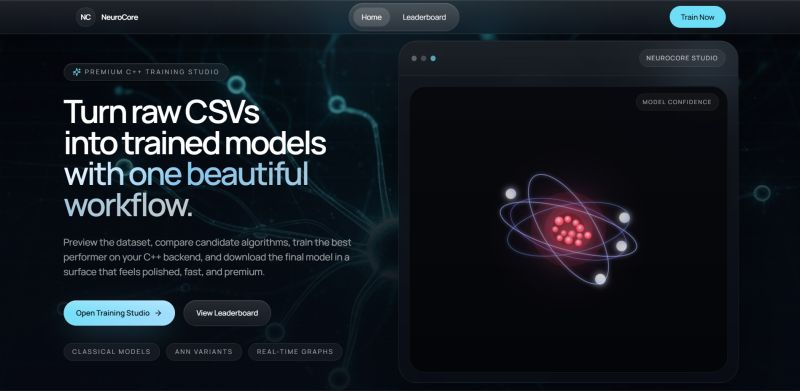
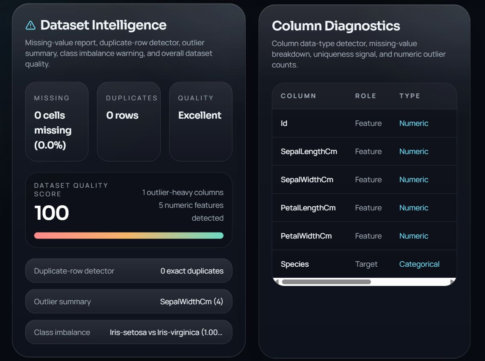
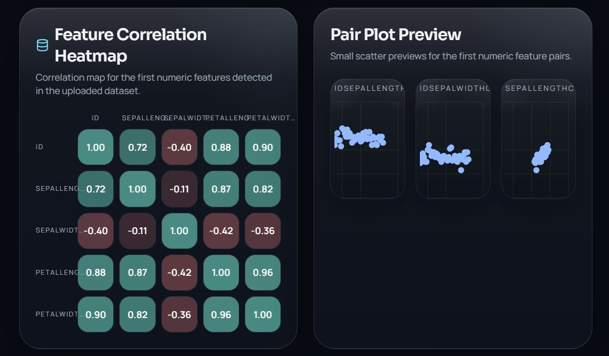

# NeuroCore Frontend







Frontend for [mlmadeeasy.in](https://mlmadeeasy.in), the public-facing NeuroCore experience.

NeuroCore is built to make machine learning feel practical and approachable. This app presents the product story, highlights the platform, and includes a working ML workbench experience with a leaderboard route for model training and evaluation workflows.

## Overview

This repository contains the website frontend for NeuroCore. It is a React single-page application built with Vite and TypeScript, styled with Tailwind CSS and shadcn/ui, and wired with route-based navigation for the home page and leaderboard page.

### What you will find here

- A polished landing page for mlmadeeasy.in
- A dedicated ML workbench flow with dataset upload and model analysis UI
- A leaderboard route for comparing runs and model results
- Reusable UI primitives from shadcn/ui
- Responsive, animated sections powered by Framer Motion

## Architecture

The app is organized as a routed React frontend with a simple, maintainable structure:

- `src/main.tsx` mounts the app and loads the global styles.
- `src/App.tsx` defines the shared providers and route tree.
- `src/pages/Index.tsx` renders the main landing page experience.
- `src/pages/Leaderboard.tsx` renders the leaderboard/workbench route.
- `src/components` contains the modular landing page sections and shared layout pieces.
- `src/components/ui` contains reusable shadcn/ui building blocks.
- `src/hooks` contains shared hooks used across the app.
- `backend` contains the companion server-side project for any API or training workflow integration.

## System Workflow

That backend is a separate C++17 ML engine. The system works in a clear pipeline:

The frontend captures the user's intent, such as dataset actions, model choices, and training requests.

The backend reads configuration, applies CLI or YAML overrides, and prepares the run.

AutoML selects the model family, optimizer, and learning rate before training starts.

The tensor engine and autodiff graph handle forward execution and gradient propagation.

Model layers execute the selected ANN, CNN, RNN, or Transformer path.

The trainer performs optimization, tracks loss, and records training history.

Finally, the backend exports artifacts such as logs, `loss_curve.csv`, and `graph.dot` for analysis and visualization.

```mermaid
flowchart LR
	A[Frontend UI\nmlmadeeasy.in] --> B[Request Capture\nDataset, model, training intent]
	B --> C[Backend C++17 Engine\nNeuroCore Engine]
	C --> D[Config + AutoML\nCLI / YAML / model selection]
	D --> E[Tensor + Autodiff\nForward pass + gradients]
	E --> F[Model Layers\nANN / CNN / RNN / Transformer]
	F --> G[Trainer\nLoss, optimizer, history]
	G --> H[Artifacts\nlogs, loss_curve.csv, graph.dot]
	H --> I[Results in UI\ncharts, visuals, feedback]
```



## Tech Stack

- React 18
- TypeScript
- Vite
- Tailwind CSS
- shadcn/ui
- React Router
- TanStack Query
- Framer Motion
- Recharts
- Lucide Icons

## Project Structure

- `src/pages` contains the routed pages
- `src/components` contains the landing page sections and shared UI pieces
- `src/components/ui` contains the shadcn/ui component library
- `src/hooks` contains shared React hooks
- `backend` contains the companion backend service for local development or deployment workflows

## Getting Started

### Prerequisites

- Node.js 18 or newer
- npm, pnpm, yarn, or bun

### Install dependencies

```bash
npm install
```

### Run the app locally

```bash
npm run dev
```

Then open the local URL shown in the terminal, usually `http://localhost:5173`.

## Available Scripts

```bash
npm run dev        # Start the Vite dev server
npm run build      # Build for production
npm run preview    # Preview the production build locally
npm run lint       # Run ESLint
npm run test       # Run Vitest once
npm run test:watch # Run Vitest in watch mode
```

## Deployment

The frontend is ready to deploy as a standard Vite static site. A common setup is:

1. Run `npm run build`.
2. Deploy the generated `dist` folder to your hosting provider.
3. Point the domain `mlmadeeasy.in` at the deployed site.

The repository also includes `vercel.json`, so Vercel deployments can be used without additional routing changes.

## Notes

- This repository is the frontend only. If you are deploying the full product, make sure the backend service is configured separately.
- The app uses client-side routing, so your hosting provider should serve `index.html` for unknown routes.
